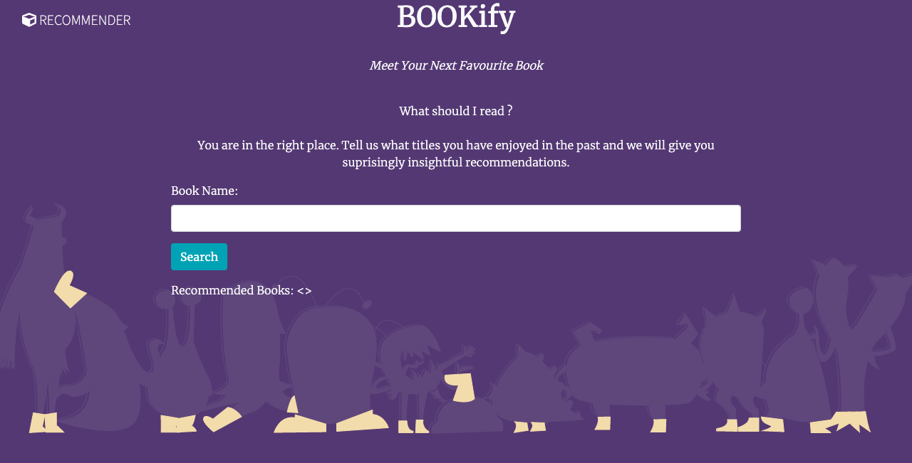
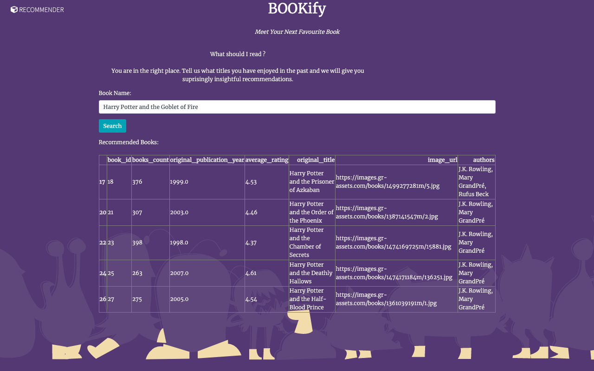

# BOOKify
 BOOKify is a Book Recommendation Web Application that gives some suprisingly insightful recommendations when you search books that you have enjoyed reading in the past.
 The machine learning algorithm used here is SVD ( Singular Value Decomposition) which uses collaborative filtering approach and  builds a model based on the past behaviour of users. 

 Advantages of SVD algorithm:
 * reduces dimentionality
 * reduces storage cost
 * can be used for large data sets
 * improves algorithm results

# Features
* Gives recommenadations based on the ratings that are given to books by the users in descreasing order.
* Displays recommended books in a tabular form which contains the book title, authors, image, publishing year and the rating given to the book.
* Gives rcommendations in just a second.
* Contains more than 10,000 books. 


# Screenshots




# To run locally
* Clone the project

  ```
  git clone https://github.com/NandiniMotwani/Engage_BookRecommendation_BOOKify
  ```

* Unzip the dataset.zip file  

* Go into the project directory
  
  ```
  cd Engage_BookRecommendation_BOOKify
  ```

* Run this command

  ```
   pip install -r requirements.txt
   ```

* Run this command

  ```
  FLASK_APP="recwebapp.py" flask run
  ```

* Copy the URL on your browser and add "/rec" at the end.

# Important note:
The book ttiles are case sensitive. Therefore, type the orginal book titles only, otherwise it will give "internal server error".


